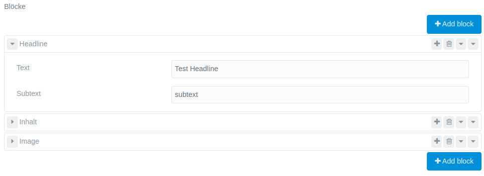
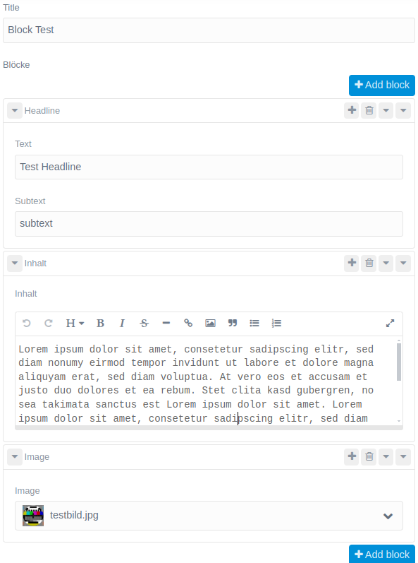
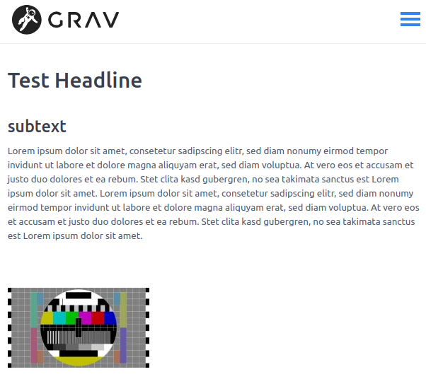
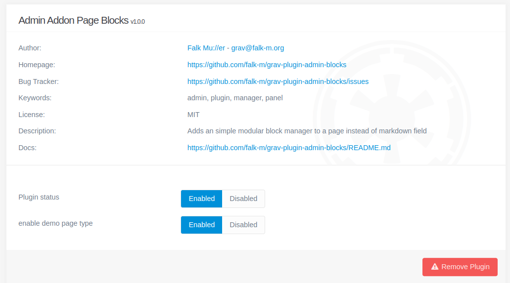

# Grav Plugin: Admin Content Blocks



This plugin let you manage our page content in modular blocks and not in one big markdown field.

It's simple and flexible. Define blocks in your page blueprints and use them in the admin panel to orchestrate the content.
Add, edit, sort, remove, ...

## Usage

### extend page types

Core feature is a new `blocks` field type. Each child field of these new field type defines a content block.
This could be a single input field or a section with multiple fields inside.

```yaml
header.blocks:
    type: blocks
    label: Blöcke
    style: vertical
    fields:
        .headline:
            type: section
            label: Headline
            fields:
                .content:
                    type: text
                    label: Text
                .subtext:
                    type: text
                    label: Subtext
        .text:
            type: editor
            label: Inhalt
        .image:
            type: filepicker
            folder: 'self@'
            preview_images: true
            label: Image
```

A full example is available in file [`./blueprints/pages/blocks.yaml`](./blueprints/pages/blocks.yaml).

### Edit page in admin

In the admin panel is an editor integrated to manage the blocks of a page:  




### edit page in editor

The 'blocks' element store the content as yaml in the markdown field header.
Each block gets a unique ID.

```yaml
---
title: 'Block Test'
media_order: 'testbild.jpg,testbild1.jpg'
blocks:
    block-1:
        headline:
            content: 'Test Headline'
            subtext: subtext
    block-2:
        text: 'Lorem ipsum dolor sit...'
    block-3:
        image: testbild.jpg
---
```

### Extend the theme



Let the theme know how to interpret the blocks.

The [example](./templates/page/blocks.html.twig) adds a 'blocks' page type to your templates. 

You can also extend the 'partials/base.html.twig' file of your theme to use blocks on all page types.

```html



    

    <div class="blocks-{{block_type}}">
        
    

        

    </div>

```

---

Each block gets a template in an own file:

`path/to/active/theme/templates/partials/blocks/headline.html.twig`

```html
<h2>{{ content.content}}</h2>

<h3>{{ content.subtext}}</h3>

```


`path/to/active/theme/templates/partials/blocks/text.html.twig`

```
{{ content|markdown() }}
```

`path/to/active/theme/templates/partials/blocks/image.html.twig`

```
{{ page.media[content].resize(200,200).html()|raw }}
```           

## Installation

### Grav Package Manager (GPM)

If you can access your Grav installation via the command line, install the plugin by typing the following from your Grav root:

```
bin/gpm install admin-blocks
```

### Admin Tool Web Interface

In the **Plugins** section, hit the **[+ Add]** button, search for Admin Content Blocks and install.

### Manual Installation

To install the plugin manually, download the ZIP version of this repository and unzip it under `/your/site/grav/user/plugins`. Then rename the folder to `admin-blocks`.

## Configuration

After installation the plugin is enabled by default. There are also new page type 'Blocks' available in the admin interface.

This page type is only for testing and presentation. You should extend our blueprints and theme.


### Admin Tool Web Interface



### Manual configuration

`/your/site/grav/user/config/plugins/admin-blocks.yaml`

```yaml
enabled: true
use_demo: false
```